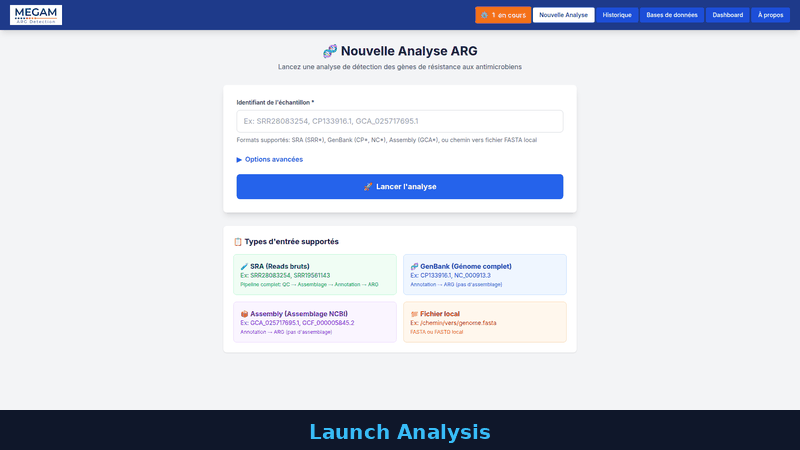

<p align="center">
  
</p>

<h1 align="center">MEGAM ARG Detection WEB</h1>

<p align="center">
  <strong>Antimicrobial Resistance Gene Detection Pipeline</strong><br>
  Web interface for ARG detection using AMRFinderPlus, ResFinder, CARD, Prokka, SPAdes/MEGAHIT
</p>

<p align="center">
  <a href="#-français">Français</a> &bull;
  <a href="#-english">English</a>
</p>

<p align="center">
  
</p>

---

## 🇫🇷 Français

### Description

MEGAM ARG Detection est une interface web moderne permettant de lancer et monitorer des analyses de détection de gènes de résistance aux antimicrobiens. Elle s'appuie sur un pipeline bash intégrant plusieurs outils de référence :

- **AMRFinderPlus** (NCBI) - Détection de gènes ARG
- **ResFinder** (via Abricate) - Base de données de résistance
- **CARD** (via Abricate) - Comprehensive Antibiotic Resistance Database
- **Prokka** - Annotation génomique
- **SPAdes/MEGAHIT** - Assemblage de novo

### Fonctionnalités

- Lancement d'analyses depuis une interface web intuitive
- Support : SRA, GenBank, Assembly NCBI, fichiers locaux
- Dashboard monitoring temps réel avec progression
- Affichage des gènes ARG par outil avec classification de priorité (CRITICAL, HIGH, MEDIUM)
- Graphiques, export CSV, accès aux fichiers générés
- Gestion des bases de données avec barres de progression
- Historique complet des analyses

### Installation

#### Prérequis

- Python 3.8+
- Conda (pour les outils bioinformatiques)
- Outils : SPAdes, Prokka, AMRFinderPlus, Abricate

#### Installation rapide

```bash
chmod +x setup.sh
./setup.sh
```

#### Bases de données

| Base | Description | Taille estimée |
|------|-------------|----------------|
| AMRFinderPlus | Détection ARG (NCBI) | ~200 MB |
| CARD | Comprehensive Antibiotic Resistance Database | ~1 GB |
| ResFinder | Base de données de résistance | ~60 MB |
| PointFinder | Mutations de résistance | ~3 MB |
| MLST | Multi-Locus Sequence Typing | ~200 MB |

Les bases peuvent être téléchargées depuis la page **Gestion des bases de données** de l'interface web.

### Démarrage

```bash
# 1. Backend API (port 8000)
cd backend && source venv/bin/activate
python -m uvicorn main:app --reload --host 0.0.0.0 --port 8000

# 2. Frontend (port 8080)
cd frontend
python3 -m http.server 8080

# 3. Ouvrir http://localhost:8080/form_launch_analysis.html
```

### Types d'entrée supportés

| Type | Format | Exemple |
|------|--------|---------|
| SRA | SRR*, ERR*, DRR* | SRR28083254 |
| GenBank | CP*, NC*, NZ_* | CP133916.1 |
| Assembly | GCA_*, GCF_* | GCA_027890155.2 |
| Local | Chemin fichier | /data/genome.fasta |

### API Endpoints

| Méthode | Endpoint | Description |
|---------|----------|-------------|
| POST | `/api/launch` | Lancer une analyse |
| GET | `/api/status/{job_id}` | Statut d'un job |
| GET | `/api/results/{job_id}` | Résultats d'un job |
| GET | `/api/jobs` | Liste des jobs |
| POST | `/api/jobs/{job_id}/stop` | Arrêter un job |
| DELETE | `/api/jobs/{job_id}` | Supprimer un job |
| GET | `/api/databases` | Liste des bases |
| POST | `/api/databases/{db_key}/update` | Mettre à jour une base |
| GET | `/api/databases/{db_key}/progress` | Progression du téléchargement |

Documentation complète : http://localhost:8000/docs

### Classification de priorité

| Niveau | Types de résistance |
|--------|---------------------|
| **CRITICAL** | Carbapénèmes, Colistine, Vancomycine, MRSA, Linézolide |
| **HIGH** | Bêta-lactamines, Fluoroquinolones, Aminoglycosides, ESBL |
| **MEDIUM** | Tétracyclines, Sulfamides, Triméthoprime, Chloramphénicol |

---

## 🇬🇧 English

### Description

MEGAM ARG Detection is a modern web interface for launching and monitoring antimicrobial resistance gene detection analyses. It relies on a powerful bash pipeline integrating multiple reference tools:

- **AMRFinderPlus** (NCBI) - ARG gene detection
- **ResFinder** (via Abricate) - Acquired resistance genes database
- **CARD** (via Abricate) - Comprehensive Antibiotic Resistance Database
- **Prokka** - Genome annotation
- **SPAdes/MEGAHIT** - De novo assembly

### Features

- Launch analyses from an intuitive web interface
- Support: SRA, GenBank, NCBI Assembly, local files
- Real-time monitoring dashboard with progress tracking
- ARG genes display per tool with priority classification (CRITICAL, HIGH, MEDIUM)
- Charts, CSV export, access to generated files
- Database management with download progress bars
- Complete analysis history

### Installation

#### Prerequisites

- Python 3.8+
- Conda (for bioinformatics tools)
- Tools: SPAdes, Prokka, AMRFinderPlus, Abricate

#### Quick Install

```bash
chmod +x setup.sh
./setup.sh
```

#### Databases

| Database | Description | Estimated size |
|----------|-------------|----------------|
| AMRFinderPlus | ARG detection (NCBI) | ~200 MB |
| CARD | Comprehensive Antibiotic Resistance Database | ~1 GB |
| ResFinder | Resistance gene database | ~60 MB |
| PointFinder | Resistance mutations | ~3 MB |
| MLST | Multi-Locus Sequence Typing | ~200 MB |

Databases can be downloaded from the **Database Management** page in the web interface.

### Quick Start

```bash
# 1. Backend API (port 8000)
cd backend && source venv/bin/activate
python -m uvicorn main:app --reload --host 0.0.0.0 --port 8000

# 2. Frontend (port 8080)
cd frontend
python3 -m http.server 8080

# 3. Open http://localhost:8080/form_launch_analysis.html
```

### Supported input types

| Type | Format | Example |
|------|--------|---------|
| SRA | SRR*, ERR*, DRR* | SRR28083254 |
| GenBank | CP*, NC*, NZ_* | CP133916.1 |
| Assembly | GCA_*, GCF_* | GCA_027890155.2 |
| Local | File path | /data/genome.fasta |

### API Endpoints

| Method | Endpoint | Description |
|--------|----------|-------------|
| POST | `/api/launch` | Launch an analysis |
| GET | `/api/status/{job_id}` | Job status |
| GET | `/api/results/{job_id}` | Job results |
| GET | `/api/jobs` | List all jobs |
| POST | `/api/jobs/{job_id}/stop` | Stop a job |
| DELETE | `/api/jobs/{job_id}` | Delete a job |
| GET | `/api/databases` | List all databases |
| POST | `/api/databases/{db_key}/update` | Update/download a database |
| GET | `/api/databases/{db_key}/progress` | Download progress |

Full documentation: http://localhost:8000/docs

### Priority Classification

| Level | Resistance types |
|-------|------------------|
| **CRITICAL** | Carbapenems, Colistin, Vancomycin, MRSA, Linezolid |
| **HIGH** | Beta-lactams, Fluoroquinolones, Aminoglycosides, ESBL |
| **MEDIUM** | Tetracyclines, Sulfonamides, Trimethoprim, Chloramphenicol |

---

## Architecture

```
MEGAM_ARG_Detection_WEB/
├── backend/                    # FastAPI API (Python)
│   ├── main.py                # API endpoints
│   ├── models.py              # Pydantic models
│   ├── database.py            # SQLite manager
│   ├── pipeline_launcher.py   # Pipeline wrapper
│   ├── output_parser.py       # TSV/HTML results parser
│   └── requirements.txt       # Dependencies
│
├── frontend/                  # Frontend HTML/JS/TailwindCSS
│   ├── form_launch_analysis.html
│   ├── dashboard_monitoring.html
│   ├── page_results_arg.html
│   ├── jobs_list.html
│   ├── databases.html
│   └── api-client.js          # API client (auto URL detection)
│
├── pipeline/                   # Bash ARG pipeline
│   ├── MANUAL_MEGA_MONOLITHIC_PIPELINE_v3.2_WEB.sh
│   ├── data/                  # Downloaded data
│   ├── outputs/               # Analysis results
│   └── databases/             # ARG databases
│
├── video/                      # Demo video (Remotion)
│   ├── src/                   # Video components
│   ├── public/screenshots/    # UI screenshots
│   └── out/                   # Rendered assets (GIF, MP4)
│
└── setup.sh                    # Automated install script
```

## Tech Stack

| Layer | Technologies |
|-------|-------------|
| **Backend** | FastAPI, SQLite (aiosqlite), Pydantic |
| **Frontend** | HTML5, Vanilla JS, TailwindCSS (CDN), Chart.js |
| **Pipeline** | Bash, Conda (bioinformatics tools) |
| **Video** | Remotion (React), TypeScript |
| **Deployment** | Uvicorn, Python HTTP server |

---

## Contact

**Rachid Merah** - rachid.merah77@gmail.com

*Version 3.2 - February 2026*
